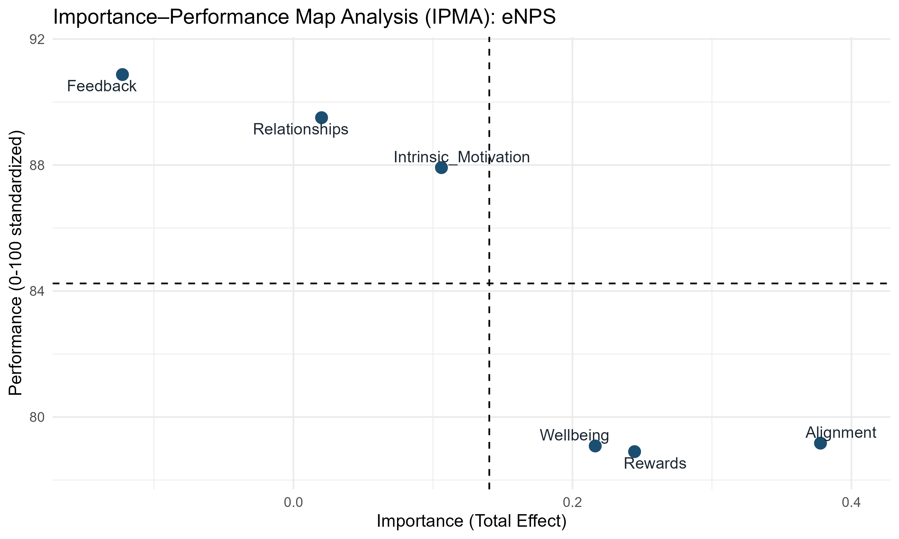
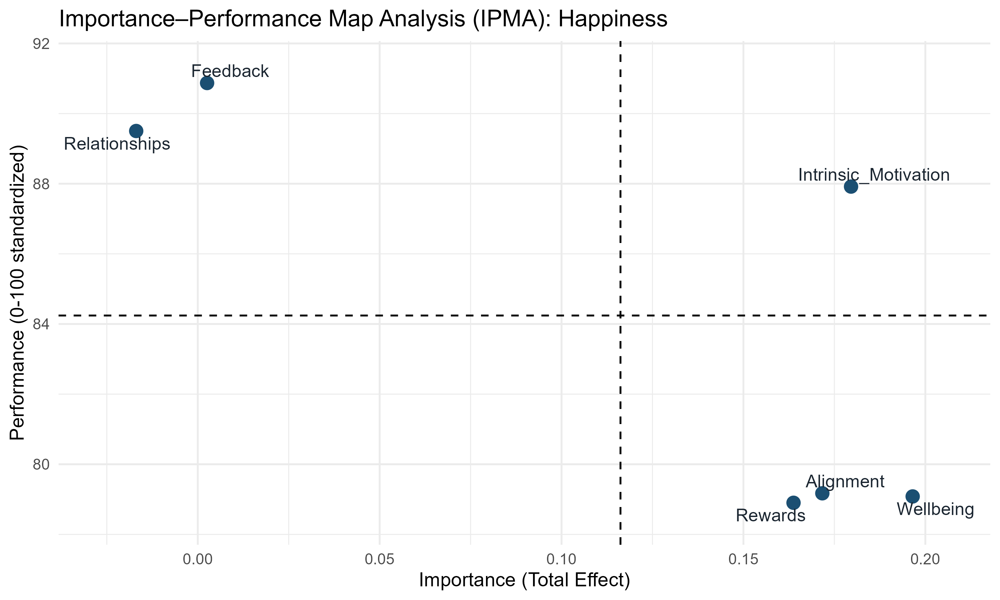

# People Analytics: Employee Experience Analytics

## Overview

### How do workplace experiences relate to employee advocacy and happiness?

Employee experience surveys contain valuable information about how people experience their work. This project applies psychometric and statistical modeling to identify which aspects of employee experience are most strongly associated with **employee advocacy (eNPS)** and **employee happiness**.

The analysis combines **SQL, psychometrics, multiple imputation, PLS-SEM, Importance-Performance Map Analysis (IPMA), and multilevel modeling** to move from survey data to actionable People Analytics insights.

> **Important:** This is an observational, cross-sectional analysis. Results describe associations and potential areas for investigation; they do not establish causal effects.

---

## Key Findings
### Employee Advocacy (eNPS)

**Alignment, Rewards, and Wellbeing** emerged as the strongest positive correlates of employee advocacy.

- Marginal $R^2$ = 0.62
- Conditional $R^2$ = 0.64

### Employee Happiness
**Wellbeing, Intrinsic Motivation, and Alignment** emerged as the strongest correlates of employee happiness.

- Marginal $R^2$ = 0.44
- Conditional $R^2$ = 0.48

### Where should organizations focus?
Importance-Performance Map Analysis identified areas that combine relatively strong relationships with the outcomes and opportunities for improvement.

|Outcome|	Highest-priority areas |
|--------|-----------------------|
| eNPS |	Alignment, Rewards |
| Happiness |	Wellbeing, Intrinsic Motivation, Alignment |

### Employee Advocacy


*Importance-Performance Map for employee advocacy (eNPS).*

### Employee Happiness



*Importance-Performance Map for employee happiness.*

---

## Team Context Matters

Employees are nested within teams, so employee-level observations are not necessarily independent. Multilevel modeling was used to account for this structure.

The difference between marginal and conditional $R^2$ indicates that **team-level context provides additional explanatory information**, particularly for employee happiness.

This suggests that employee experience may not be solely an individual-level phenomenon and raises an important organizational question:

> **What is happening at the team or manager level that contributes to differences in employee experience?**

---

## An Important Model Finding

Feedback showed a negative coefficient in the multivariate models despite having a positive bivariate relationship with the outcomes.

This pattern is consistent with **statistical suppression**, rather than evidence that feedback is harmful. When correlated employee-experience dimensions are modeled simultaneously, coefficients represent each predictor's unique association after accounting for the others.

This is an important consideration in People Analytics: **individual coefficients should be interpreted within the broader model rather than in isolation.**

---

## Analytical Approach

```Employee Survey Data
        ↓
    SQL Cleaning
        ↓
 Multiple Imputation
        ↓
Psychometric Modeling
        ↓
     PLS-SEM
      ↙    ↘
    IPMA    MLM
      ↘    ↙
People Analytics Insights
```

## Methods

- **SQL**: Data preparation and cleaning
- **MICE**: Multiple Imputation by Chained Equations for missing data
- **Psychometric Modeling**: Evaluation of latent employee level constructs
- **PLS-SEM**: Partial Least Squares Structural Equation Modeling to estimate relationships among latent constructs and outcomes
- **IPMA**: Importance–Performance Map Analysis to identify areas of relatively high importance and opportunities for improvement
- **MLM**: Multilevel Modeling to account for employee clustering within teams
- **R/R Markdown**: Statistical analysis and reproducible reporting

## Why Psychometrics Matter
Employee experience variables such as Wellbeing, Alignment, Intrinsic Motivation, Rewards, and Feedback are latent constructs measured through survey items rather than directly observed. Before interpreting relationships between employee experience and outcomes, the analysis evaluates the quality of those measures through:

- Internal consistency and reliability
- Indicator loadings
- Discriminant validity
- Multicollinearity
- Construct correlations
- Intraclass correlations

This reflects a core principle of People Analytics:

> **Good decisions depend on good measurement.**

The underlying measurement outputs are available in the [`Outputs/Diagnostics/`](Outputs/Diagnostics/) and [`Outputs/PLS_SEM/`](Outputs/PLS_SEM/) directories.

## Analysis Pipeline

The analysis is organized as a reproducible sequence:

| Step | Script | Purpose |
|---|---|---|
| 1 | [`01_item_preprocessing.R`](R/01_item_preprocessing.R) | Prepare survey items |
| 2 | [`02_imputation.R`](R/02_imputation.R) | Handle missing data |
| 3 | [`03_pls_sem.R`](R/03_pls_sem.R) | Estimate PLS-SEM models |
| 4 | [`04_pls_sem_exports.R`](R/04_pls_sem_exports.R) | Export model results |
| 5 | [`05_ipma.R`](R/05_ipma.R) | Conduct IPMA |
| 6 | [`06_hlm.R`](R/06_hlm.R) | Estimate multilevel models |

SQL preprocessing is contained in:

- [`Employee_cleaning_01.sql`](SQL/Employee_cleaning_01.sql)
- [`Employee_cleaning_02.sql`](SQL/Employee_cleaning_02.sql)

## People Analytics Implications

The findings point to several areas for organizational investigation:

- Alignment: Are employees clear about organizational and team priorities?
- Rewards: Do employees perceive recognition and rewards as fair and meaningful?
- Wellbeing: Where are workload and wellbeing risks concentrated?
- Intrinsic Motivation: Do employees experience meaning, autonomy, and purpose in their work?
- Team context: Do employee experiences vary systematically across teams or managers?

The analysis is intended to help identify where organizations might look next, rather than prescribe specific interventions. For example, a strong association between wellbeing and happiness does not establish that increasing wellbeing will cause happiness to increase. Establishing that relationship would require longitudinal, experimental, or quasi-experimental evidence.

## Limitations
This analysis is observational and therefore identifies associations rather than causal effects. 
Additional limitations include:

- Self-reported survey data
- Potential response and common-method bias
- Limited generalizability beyond the study population
- Cross-sectional data, which limits conclusions about changes over time

## Detailed Report
The complete analysis, including model diagnostics, statistical results, tables, visualizations, and recommendations, is available in the technical [report](Report/Report.Rmd). The reproducible analysis is provided through the R and SQL scripts in the repository.

## Dataset
The dataset used in this project is publicly available through Kaggle:

**Employee Stress & Experience**  
[https://www.kaggle.com/datasets/harriken/myhappyforce-survey-employee-stress/data](https://www.kaggle.com/datasets/harriken/myhappyforce-survey-employee-stress/data)

### License & Attribution  
This dataset is released under the **EU Open Data Portal (EU ODP) Legal Notice**, which permits reuse, modification, and redistribution with attribution.

> This project uses publicly available, de‑identified data released under the EU ODP Legal Notice. The dataset is sourced from Kaggle and included solely for educational and portfolio purposes.

Please refer to the original dataset license before reusing the data.

